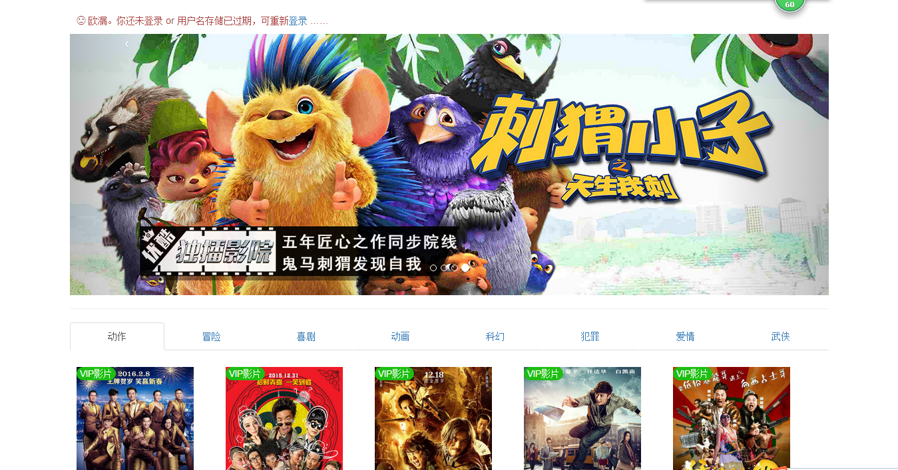
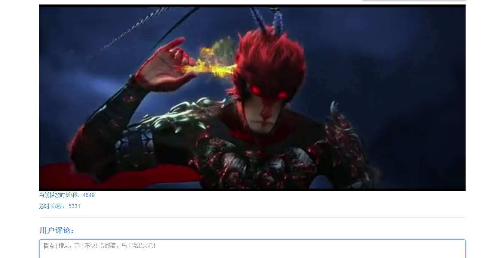

## 网站相关技术：

django框架搭建整个网站

bootstrap作为前端样式框架

使用微信JS-SDK开发工具包，对接微信分享API,使之视频播放页面支持微信分享

python用于程序后台逻辑处理

使用django自带的数据库Sqlite3存储网站数据

> Admin（后台管理）:

用户名：root      密码：root

需要装插件：
    'rest_framework',
    'rest_framework_swagger',

有什么不懂问本人：微信：１３７１８８４８６８４

--------------------------
## 网站展示：

* __首页:__

* __播放页面:__

